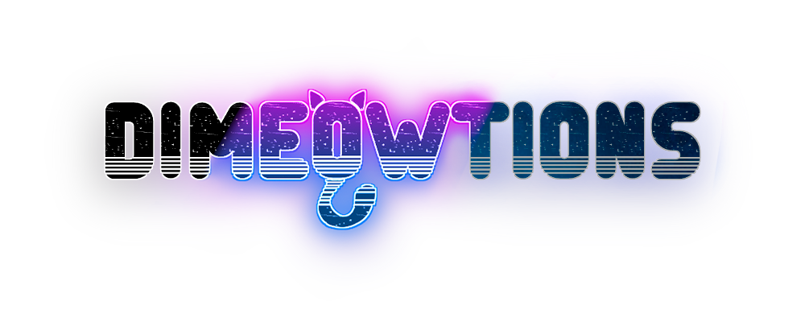

# DIMEOWTIONS

Dimeowtions is a 3D first person runner about Bareton the cat, a kitten who, while trying to follow his human to work, accidentally falls into a mysterious tunnel that takes him to unknown dimensions. He must find a way to escape from there, facing numerous challenges across several worlds.

This is a game being developed by students from <a href="https://www.imagecampus.edu.ar/">Image Campus</a>

   

## Credits

- **Matias Pierpaoli** - *Programming*
- **Tomas ‘Okami’ Porte Petit** - *Programming*
- **Candela ‘Gochie’ Formigo** - *Art*
- **Ezequiel ‘Drawnah’ Nicanor Muñoz** - *Art*
- - **Tomas ‘Cenfe’ Verhagen** - *Art*
- **Daria Chiroleu** - *Audio*
- **Felipe ‘Flippa’ Goizueta** - *Audio*
-  **Emiliano Laiño** - *Audio*
- **Nicolas Nahuel Carnota** - *Testing*
- **Sebastian Cretella** - *Testing*
- **Valentin Andres Gamero** - *Testing*
- **Mateo ‘Tylr2’ Taylor** - *Testing*

This game was also possible thanks to the support of these professors:

- **Sergio Baretto**
- **Juan Pablo Varela Aloisio**
- **Ramiro Cabrera**
- **Eugenio Taboada**
- **Nazareno Rivero**
- **Lucía Inés Patetta**

## Acknowledgements

- **Federico Barra**
- **Franco Guerra**
- **Silvina Lemos Hoffmann**

## Links

Download it from itch.io: https://drawnah.itch.io/dimeowtions
